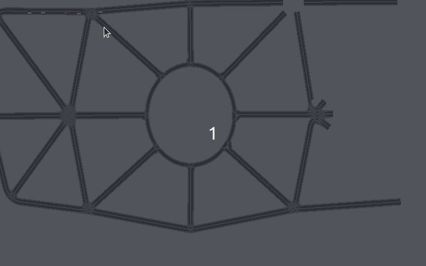
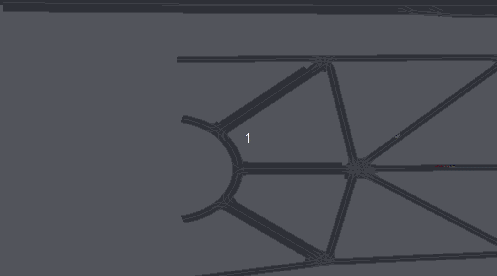

<!--********************************************************************************
 * Copyright (C) 2017-2020 German Aerospace Center (DLR). 
 * Eclipse ADORe, Automated Driving Open Research https://eclipse.org/adore
 *
 * This program and the accompanying materials are made available under the 
 * terms of the Eclipse Public License 2.0 which is available at
 * http://www.eclipse.org/legal/epl-2.0.
 *
 * SPDX-License-Identifier: EPL-2.0 
 *
 * Contributors: 
 *   Sami Dhiab - Test Scenarios Generation
 * catalog test cases from 28 suggested scenarios from nhtsa.
 * Description and result 
 ********************************************************************************-->
# Catalog Test Cases
this document demonstrate the behavioral competencies for the system under test based on test cases suggested from nhtsa. 

Along this document you will find test description, animation and related launch file. 

For more Informations: 

see [link](https://www.nhtsa.gov/sites/nhtsa.dot.gov/files/documents/13882-automateddrivingsystems_092618_v1a_tag.pdf) to nhtsa report. 

see [Table](https://wiki.dlr.de/display/urbandrive2/Behavioral+Competencies%3A+ADORe+in+comparison+with+NHTSA) of comparison between nhtsa, waymo and ADORe 

## 1- Parking
### test001_parking.launch

Function Not included yet
see [file](test001_parking.launch)

## 2- lane following
### test002_lane_following.launch

in this Scenario, following criteria should be maintained:
 *  Car Following
 *  Speed Maintenance
 *  Lane Centering

In the animation below, the ego is following the leading sumo vehicle, mainting a speed under 5m/s and driving in centre of line during the test.
sumo vehicle has a max speed of 5m/s.

 

to verify the speed of ego and sumo vehicles, we check the topic traffic with this command:
~~~bash
rostopic echo vehicleX/traffic
~~~
with X the id of ego vehicle in launch file.
in the json data below, data traffic are published, the ego trackingID is equivalen to 1000, sumo vehciles trackingID are upper to 1000 such as 1001 correspend at the first sumo vehicle appearing in the simulation and so on. 
the speed correspond to twist:twist:linear:x.
~~~json
    data: 
      time: 45.0
      motion_state: 
        header: 
          seq: 0
          stamp: 
            secs: 45
            nsecs:         0
          frame_id: &apos;&apos;
        child_frame_id: &apos;&apos;
        pose: 
          pose: 
            position: 
              x: 40.76871233860872
              y: 163.01981344545305
              z: 0.0
            orientation: 
              x: 0.0
              y: 0.0
              z: 0.03545783638575293
              w: 0.9993711732078533
          covariance: [0.0, 0.0, 0.0, 0.0, 0.0, 0.0, 0.0, 0.0, 0.0, 0.0, 0.0, 0.0, 0.0, 0.0, 0.0, 0.0, 0.0, 0.0, 0.0, 0.0, 0.0, 0.0, 0.0, 0.0, 0.0, 0.0, 0.0, 0.0, 0.0, 0.0, 0.0, 0.0, 0.0, 0.0, 0.0, 0.0]
        twist: 
          twist: 
            linear: 
              x: 4.999278685454047
              y: 0.0
              z: 0.0
            angular: 
              x: 0.0
              y: 0.0
              z: 0.0
          covariance: [0.0, 0.0, 0.0, 0.0, 0.0, 0.0, 0.0, 0.0, 0.0, 0.0, 0.0, 0.0, 0.0, 0.0, 0.0, 0.0, 0.0, 0.0, 0.0, 0.0, 0.0, 0.0, 0.0, 0.0, 0.0, 0.0, 0.0, 0.0, 0.0, 0.0, 0.0, 0.0, 0.0, 0.0, 0.0, 0.0]
      shape: 
        type: 0
        dimensions: [5.0, 1.8, 1.5]
      dimensions_variance: 0.0
      classification: 
        type_id: 0
      classification_certainty: 0
      existance_certainty: 100
      leftIndicatorOn: False
      leftIndicator_certainty: 0
      rightIndicatorOn: False
      rightIndicator_certainty: 0
      brakeLightOn: False
      brakeLight_certainty: 0
      lowBeamOn: False
      lowBeam_certainty: 0
      highBeamOn: False
      highBeam_certainty: 0
      v2xStationID: 0
      v2xStationID_certainty: 0
    trackingID: 1001
    detection_by_sensor: 0
  - 
    data: 
      time: 45.0
      motion_state: 
        header: 
          seq: 0
          stamp: 
            secs: 45
            nsecs:         0
          frame_id: &apos;&apos;
        child_frame_id: &apos;&apos;
        pose: 
          pose: 
            position: 
              x: 65.67909104357948
              y: 163.80164469456452
              z: 0.0
            orientation: 
              x: 0.0
              y: 0.0
              z: 0.005216518541127433
              w: 0.9999863938745918
          covariance: [0.0, 0.0, 0.0, 0.0, 0.0, 0.0, 0.0, 0.0, 0.0, 0.0, 0.0, 0.0, 0.0, 0.0, 0.0, 0.0, 0.0, 0.0, 0.0, 0.0, 0.0, 0.0, 0.0, 0.0, 0.0, 0.0, 0.0, 0.0, 0.0, 0.0, 0.0, 0.0, 0.0, 0.0, 0.0, 0.0]
        twist: 
          twist: 
            linear: 
              x: 4.996935874406481
              y: 0.0
              z: 0.0
            angular: 
              x: 0.0
              y: 0.0
              z: 0.0
          covariance: [0.0, 0.0, 0.0, 0.0, 0.0, 0.0, 0.0, 0.0, 0.0, 0.0, 0.0, 0.0, 0.0, 0.0, 0.0, 0.0, 0.0, 0.0, 0.0, 0.0, 0.0, 0.0, 0.0, 0.0, 0.0, 0.0, 0.0, 0.0, 0.0, 0.0, 0.0, 0.0, 0.0, 0.0, 0.0, 0.0]
      shape: 
        type: 0
        dimensions: [5.0, 1.8, 1.5]
      dimensions_variance: 0.0
      classification: 
        type_id: 0
      classification_certainty: 0
      existance_certainty: 100
      leftIndicatorOn: False
      leftIndicator_certainty: 0
      rightIndicatorOn: False
      rightIndicator_certainty: 0
      brakeLightOn: False
      brakeLight_certainty: 0
      lowBeamOn: False
      lowBeam_certainty: 0
      highBeamOn: False
      highBeam_certainty: 0
      v2xStationID: 0
      v2xStationID_certainty: 0
    trackingID: 1000
    detection_by_sensor: 0</pre>
~~~
As you can see, speed is maintained with repsect to the safe longitudinal distance between ego and sumo vehicle, wich can be given as the difference between their positions(pose:pose:position:x):
~~~python
xEgo=65 #ego pos
xPov=40 #sumo pos
s=5 #speed ego
Delta = abs(xEgo-xPov) #25m
# since we are driving inside urban, the speed limit is 50km/h or max ~15m/s, the ego speed speed is under 50km/h so the following formula applies:
SafeDistance = int((s*3.6) / 3.33) #5m
# Delta is bigger than safe distance, wich is true
~~~

see launch [file](test002_lane_following.launch)

## 3- Lane Change
### test003_lane_change.launch
in this Scenario, following criteria should be maintained:
 * Lane Switching/ Overtaking

the animation below shows, how the ego is switching line to stop at the crossing area. 

 

see launch [file](test003_lane_change.launch)

### test003_lane_change_merge.launch

in this Scenario, following criteria should be maintained:
 * low speed merge

the animation below demonstrate, how the ego is taking a merge manouver to the left lane on low speed.
 

see launch [file](test003_lane_change_merge.launch)

## 4- navigate intersection
### test004_navigate_intersection_onramp.launch

in this Scenario, following criteria should be maintained:
 * navigate on ramp

the animation below demonstrate, how the ego is taking on ramp to enter the highway.
 

see launch [file](test004_navigate_intersection_onramp.launch)

### test004_navigate_intersection_offramp.launch

in this Scenario, following criteria should be maintained:
 * navigate off ramp

the animation below demonstrate, how the ego is taking off ramp to exit the highway.
 

see launch [file](test004_navigate_intersection_offramp.launch)

### test004_navigate_intersection_Roundabouts.launch

in this Scenario, following criteria should be maintained:
 * navigate Roundabouts

the animation below demonstrate, how the ego is navigating roundabout.

 

see launch [file](test004_navigate_intersection_roundabouts.launch)

### test004_navigate_intersection_lrs.launch

in this Scenario, following criteria should be maintained:
 * Intersection (left, right, straight)

 the animation below demonstrate, how the ego is navigating intersection.
 first intersection to the right, second to the left and third is straight to the goal.

 

see launch [file](test004_navigate_intersection_lrs.launch)

### test004_navigate_intersection_crosswalk.launch

in this Scenario, following criteria should be maintained:
 * Crosswalk

 the animation below demonstrate, how the ego is navigating crosswalk, 
 and detecting pedestrians crossing.

 

see launch [file](test004_navigate_intersection_crosswalk.launch)

### test004_navigate_intersection_uturn.launch

in this Scenario, following criteria should be maintained:
 * U-Turn

 the animation below demonstrate, how the ego is navigating U-Turn.

 

see launch [file](test004_navigate_intersection_uturn.launch)
