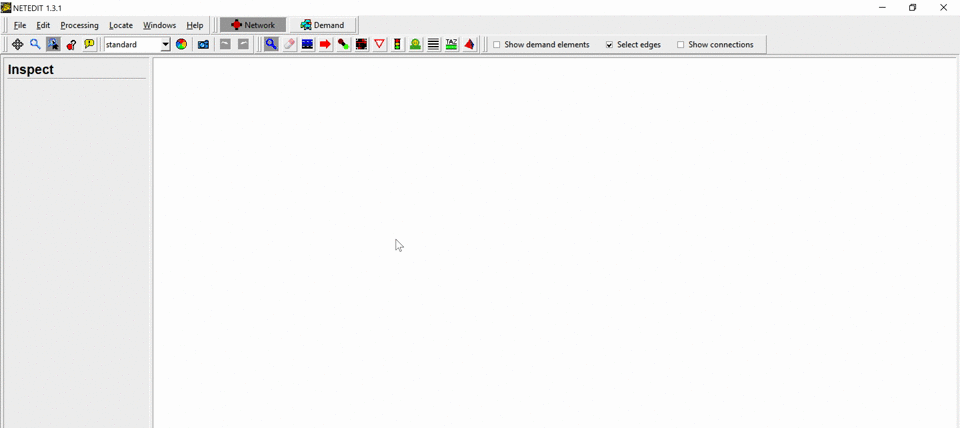
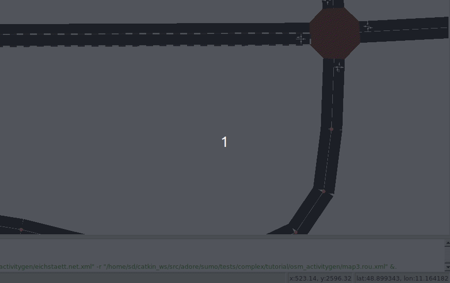

<!--
********************************************************************************
*Quick Tutorial to create a sumo custom track, import *OpenStreetmap, modify launch file..
*Source: https://sumo.dlr.de/docs/Tutorials/
********************************************************************************
-->
# 1-SUMO: create a basic track
## Creating the Network in netedit
~~~bash
netedit #open netedit from sumo
~~~
Open netedit and create a new network by selecting File->New Network or using the shortcut Ctrl + N

Nodes are created by clicking on empty spaces (when in Edge Mode). Insert 3 nodes (aka Junctions) by clicking on three different places at the white blank space. After inserting the last Node, press <ESC> to unselect that last node

In Inspect mode you can select different type of elements, such as Nodes and Edges. If an element is selected, its properties will appear on the left side. Let's rename (change their id) the nodes to "1", "2" and "3" (from left to right) and the edges to "1to2" and "out" (also left to right). Change pos(x,y) repectively to (-100,50),(0,50) and (100,50) for this tutorial or whatever values you want.

Our very basic network is done! We just need to save it . Use File -> Save Network (Ctrl + S) or File -> Save Network As (Ctrl + Shift + S) and give it a proper name (such as helloWorld.net.xml)
In SUMO, Networks must have the following file extension -> .net.xml (example: myNetwork.net.xml)
## Demand Generation in netedit

Enter Route Mode by selecting Edit->Route mode, using the shortcut R or by clicking on the button.
Creating a route is as simple as clicking on the Edges that will compose it. When selecting an Edge, its color will change.

Finally, enter Vehicle Mode by selecting Edit->Vehicle mode, using the shortcut V or by clicking on the button. To insert a Vehicle, just click on the beginning of the route. A car will appear. On the left side bar you can change the vehicle's attributes such as id and even the color (just for fun change it to blue).

Now save the Demand (route + vehicle) file . Use File -> Demand elements -> Save demand elements (Ctrl + Shift + D) or File -> Demand elements -> Save demand elements as and give it a proper name (such as helloWorld.rou.xml).
Do not close netedit yet.
This demand element file must have the .rou.xml file extension!
#### Important
Save all simulation related files (Network, Demand and SUMO Configuration file) in the same directory.
## Visualizing in sumo-gui
We will open sumo-gui from netedit. To do so, go to Edit -> Open in sumo-gui (Ctrl + T). This will open sumo-gui and load our recently created network and demand files.
As soon as sumo-gui opens, let's save the SUMO configuration file (that relates the network and demand files) . File -> Save Configuration (Ctrl + Shift + S). Give it a proper name (such as helloWorld.sumocfg).
Now you can close netedit if you wish.
SUMO Configuration files have the following file extension -> .sumocfg (example: myScenario.sumocfg)
Before starting the simulation, make sure that the Delay is set to at least 20 ms, otherwise, the simulation would happen very fast and we would not be able to see our only vehicle in our tiny network.
Click on Run (Ctrl + A) to start the simulation.

From now on, if we want to run this scenario again we only have to open the SUMO Configuration file (*.sumocfg) in sumo-gui or sumo.
[Source](https://sumo.dlr.de/docs/Tutorials/Hello_World.html) 
# 2-SUMO: import network from OpenStreetMap(old script method)
The OSM Web Wizard is essentially a collection of python scripts located under the directory tools in your sumo installation root. You start the OSM Web wizard by invoking the following command in the tools directory:
~~~bash
python osmWebWizard.py 
~~~

You may zoom and pan to the area of your interest. Caution: if the map excerpt covers a very large area, the simulation might become slow or even unresponsive. We suggest to choose a similar zoom level as in the initial view.
In the next step, you select the actual area for which you want to generate the simulation scenario. The area selection will be activated by clicking the check box Select Area at the blue area selection panel on the right side of the map.

You can change the size and location of this area by click and hold with the mouse pointer at the boundary between the grayed and non-grayed area. Once you are satisfied with the area selection, you can proceed to the next step.
## Network Generation

The infrastructure import from OSM into the SUMO simulation are affected by different Wizard options

- by default a road traffic simulation is generated but all types of roads and rails will be imported as well (cycle paths, footpaths, railways etc)
- if the checkbox "left-hand Traffic" is enabled, the network will be built with left hand traffic rules. For most geographic regions where this is required, this feature will be enabled automatically but if it does not work, this option can be used as a remedy.
- if the checkbox "Car-only Network" is enabled, then only roads that permit passenger car traffic will be included. This can be used to reduce the network size and also helps to reduce intersection complexity
- if the checkbox "Import Public Transport" is enabled, then busStops and trainStops will be exported. Also busses, trams and trains will be generated that follow the public transport routes defined in OSM (but they will follow synthetic schedules).
- if the Demand-checkbox "Bicycles" is active, then extra bicycle lanes will be added to roads where OSM contains this information
- if the Demand-checkbox "Pedestrians" is active, then sidewalks and pedestrian crossings will be generated
## Demand Generation
The demand is defined by the demand generation panel. You activate this panel by clicking on the car pictogram.

SUMO supports various modes of transport. At the demand generation panel, you can activate/deactivate the individual modes of transport by clicking the corresponding checkboxes. For each mode of transport, the OSM Web Wizard generates random demand based on a certain probability distribution, which is influenced by two parameters:

- Every time a new vehicle is generated, the OSM Web Wizard randomly chooses a departure and arrival edge for the vehicle. The Through Traffic Factor defines how many times it is more likely for an edge at the boundary of the simulation area being chosen compared to an edge entirely located inside the simulation area. A big value for the Through Traffic Factor implies that many vehicles depart and arrive at the boundary of the simulation area, which corresponds to a scenario with a lot of through traffic.
- The Count parameter defines how many vehicles are generated per hour and lane-kilometer. Assuming
    - the network contains 3 edges with a combined length of 5 km
        that each has 2 lanes which allows the current traffic mode
        and the count value is set to 90,
        then 5 * 2 * 90 = 900 vehicles per hour will be generated. This translates to a randomTrips parameter of p=4 which means a new vehicle is inserted every 4 seconds somewhere in the network.

The next step is generating and running the scenario.
## Generating and Running the scenario

The complete scenario will be generated automatically once Generate Scenario in the control panel has been clicked. The scenario generation takes a couple of seconds or minutes (depending, among others, on the size of the scenario). Once the scenario generation process has finished, the sumo-gui starts and the simulation can be started by pressing the Play button.

The OSM Web Wizard stores the entire simulation scenario sumo config and intermediate files in a local directory with a name in the format of yyyy-mm-dd-hh-mm-ss. If your SUMO installation location is writeable, the data will be stored inside the tools directory. Otherwise, a new directory ~/SUMO/yyyy-mm-dd-hh-mm-ss will be created to host the data. The contents of the directory look like this:
~~~bash
➜  2016-10-17-14-54-30 ls
   build.bat                  osm.net.xml                osm.rail.rou.alt.xml       osm.tram.rou.alt.xml
   osm.bicycle.rou.alt.xml    osm.netccfg                osm.rail.rou.xml           osm.tram.rou.xml
   osm.bicycle.rou.xml        osm.passenger.rou.alt.xml  osm.rail.trips.xml         osm.tram.trips.xml
   osm.bicycle.trips.xml      osm.passenger.rou.xml      osm.rail_urban.rou.alt.xml osm.truck.rou.alt.xml
   osm.bus.rou.alt.xml        osm.passenger.trips.xml    osm.rail_urban.rou.xml     osm.truck.rou.xml
   osm.bus.rou.xml            osm.pedestrian.rou.alt.xml osm.rail_urban.trips.xml   osm.truck.trips.xml
   osm.bus.trips.xml          osm.pedestrian.rou.xml     osm.ship.rou.alt.xml       osm.view.xml
   osm.motorcycle.rou.alt.xml osm.pedestrian.trips.xml   osm.ship.rou.xml           osm_bbox.osm.xml
   osm.motorcycle.rou.xml     osm.poly.xml               osm.ship.trips.xml         run.bat
   osm.motorcycle.trips.xml   osm.polycfg                osm.sumocfg
~~~
[Source](https://sumo.dlr.de/docs/Tutorials/OSMWebWizard.html)
# 3-Convert sumo network to opendrive
after creating a network from last tutorial and in order to use this track for ros launch files, we need to convert .net.xml to .xodr:
~~~bash
netconvert -s FILE.net.xml --opendrive-output FILE.xodr
~~~
otherwise, to open opendrive files with sumo, we need to convert them backwards:
~~~bash
netconvert --opendrive FILE.xodr -o FILE.net.xml 
~~~
# 4-Including sumo and opendrive in ros launchfiles
Sumo and opendrive files are located under [tracks](../tracks).
A very simple Launch file look like this:

to load track as opendrive format, this line should be fullfilled:
~~~xml
<param name="PARAMS/track" value="$(dirname)/../tracks/customTrack.xodr" type="str" />
~~~
to load sumo configuration, this line should be fullfilled:
~~~xml
<arg name="sumocfg" value="$(dirname)/../tracks/customTrack.sumocfg"/>
~~~
Note that when inserting Ego vehicle, the coordinate are relative to the coordinate from the network.
otherwise the ego will be outside the track(see first tutorial, nodes (aka Junctions)(x,y)). This line should be edited:
~~~xml
<node pkg="rostopic" type="rostopic" name="posereset" args="pub /vehicle1/SIM/ResetVehiclePose geometry_msgs/Pose '{position: {x: 0, y: -2, z: 0},orientation: { w: 1}}'"/>
~~~
To avoid unexpected behavior, the Ego vehicle should in centre of the right lane. if Ego doesn't start, try to adjust the values of x, y or z.
Analog to Ego start position, the goal position should be relative to the network.
~~~xml
<node pkg="rostopic" type="rostopic" name="navgoal" args="pub /vehicle1/ENV/NavigationGoal adore_if_ros_msg/NavigationGoal '{target: {x: 150, y: 50, z: 0}}'"/>
~~~
Finally, if we run that launch file, we could see the following:

Another exemple could be given if we change the sumo and opendrive files.
This example include more sumo vehicle.
load opendrive file:
~~~xml
<param name="PARAMS/track" value="$(dirname)/../tracks/freeway_70_2_Spur.xodr" type="str" />
~~~
load sumo config file:
~~~xml
<arg name="sumocfg" value="$(dirname)/../tracks/freeway_70_2_Spur.sumocfg"/>
~~~
change pos ego according to track:
~~~xml
<node pkg="rostopic" type="rostopic" name="posereset" args="pub /vehicle1/SIM/ResetVehiclePose geometry_msgs/Pose '{position: {x: 0, y: -2, z: 0},orientation: { w: 1}}'"/>
~~~
change goal pos according to track:
~~~xml
<node pkg="rostopic" type="rostopic" name="navgoal" args="pub /vehicle1/ENV/NavigationGoal adore_if_ros_msg/NavigationGoal '{target: {x: 2000, y: -500, z: 0}}'"/>
~~~

To switch view option, change the code below:
~~~xml
<node name="plotter" pkg="adore_if_ros" type="adore_borderbird_node"/> 
~~~
To this:
~~~xml
<node name="plotter" pkg="adore_if_ros" type="adore_fancybird_node"/> 
~~~
The new plotting should look like this:

Here you can look directly to launch [file](test001_lanefollowing_mutlisumo.launch)
# 5-Importing network from OpenStreetMap(new alternativ method) 
go to https://www.openstreetmap.org/ and search for street, city, country etc..
click export once you found the location you want.
click on "Manually select a different area" if you want adjust the square area.
finally click export and a pop-up will show up to download the map.osm file on your computer.

## Importing osm to SUMO netedit
next you need to import the osm to sumo netedit.
in a terminal write this command:
~~~bash
netedit
~~~ 
once netedit is open, go to File->import foreign network,
leave the default settings and click on OK.
if the convertion went well, you should be able to see tthe map:

next go to File->save network as and give it a name.
Now go to Edit->Demand Mode or press F3.
You can add routes, vehicle, pedestrians etc...
let's add two vehicle and two pedestrian. Check the Sumo [Tutorials](https://sumo.dlr.de/docs/Tutorials.html) website for more details on creating Demand.
Save the .rou.xml file in same directory as .osm and .net.xml files.
The last step with sumo is to switch to sumo-gui and run the simulation.
go to Edit-> open in sumo-gui
in sumo-gui go to file->save configuration and save it in same directory with last files.
To run simulation slowly, make at least a delay of 100ms and click run simulation.
you should be able to see your map with your vehicle(yellow) and pedestrians(Blue):

Feel free to add more agents ot make it more realistic like the roundabout in ernst-reuter-platz in berlin.
## Convert .osm to .xodr with netconvert 
to include the map in launch file, this osm file should be converted opendrive ".xodr" file as follow:
~~~bash
netconvert --osm-files file.osm.xml --opendrive-output file.xodr 
netconvert suggested options: --geometry.remove --ramps.guess --junctions.join --tls.guess-signals --tls.discard-simple --tls.join --tls.default-type actuated
~~~
This options are recommended from sumo to get better result with converting openstreetmap to opendrive, even if a lot of warning are manully to supress.
next we can include our .xodr file and .sumocfg file in the launch file.

## Including xodr and sumocfg to launchfile
as already described in section 3, we change the following:
~~~xml
<param name="PARAMS/track" value="$(dirname)/../tracks/map.xodr" type="str" />
~~~
load sumo config file:
~~~xml
<arg name="sumocfg" value="$(dirname)/../tracks/map.sumocfg"/>
~~~
it'S suggested to have all sumo, osm and opendrive files under same directory, like in this example the directory [tracks](../tracks).
Note: you should be aware of Ego start position and Goal position. you can get the coordinate position from sumo netedit by clicking on edges or junctions and copying the (x,y) with right click as follow:

To start the plotlabserver and the launch file in one command, in new terminal copy and paste:
~~~bash
cd ~/catkin_ws/src/adore/plotlabserver/;./stop.sh;./start.sh;roslaunch ~/catkin_ws/src/adore/test/catalog_from_nhtsa/test001_lanefollowing_mutlisumo.launch
~~~
If luanch was succeful, you sould be able to see the ego moving in lane.

## Debugging common issues
- If you see ego not moving:  
try to adjuste the ego(x,y) position. 
be aware that the ego will only start moving, if it is in centre of lane and had the traffic flow orientation of the lane.
try adjusting the orientation. if you set the orientation to {w:1}, wich means the ego heading direction, the lane should be also same directed, if the ego has a certain angle with the lane, you should rotate it on z axis with equivalent angle value: orientation: {z: ?, w: 1}}
if still not working, try to adjust the goal position. Be aware that that goal position should be further as the ego and correctly matching (x,y) on map.
Note: Rotations in ROS are described using rotation quaternions, which are represented by the four orientation values in any position.
The quaternion for a given Z axis (yaw) rotation is given by:  
w = cos(theta / 2) x = 0 y = 0 z = sin(theta / 2)  
where theta is the yaw angle in radians. If X (roll) or Y (pitch) axis rotations are involved too, the formula is a little more tedious, and can be found on [Wikipedia](https://en.wikipedia.org/wiki/Conversion_between_quaternions_and_Euler_angles#Euler_Angles_to_Quaternion_Conversion).  
example: 
below is the plotting with this configuartion'{position: {x: 17, y: 333, z: 0},orientation: { w: 1}}', as you can see the ego can't move because it's not centred.
 
for this purpose, it should be rotated on z axis. let's suggest 20 degree as angle between ego and lane. Thus sin(-20)=-0.34
if we change the configuration with new angle we get the following: 
'{x: 17, y: 333, z: 0},orientation: {z: -0.34, w: 1}}' 
the plotting below shows that ego is moving now.
 
- If you can't plott the map:  
try to convert the osm file to net.xml file first:
~~~bash
netconvert --osm-files file.osm -o file.net.xml 
netconvert suggested options: --geometry.remove --ramps.guess --junctions.join --tls.guess-signals --tls.discard-simple --tls.join --tls.default-type actuated --offset.disable-normalization
~~~
and second to convert net.xml to xodr file:
~~~bash
netconvert -s FILE.net.xml --opendrive-output FILE.xodr 
netconvert suggested options: --geometry.remove --ramps.guess --junctions.join --tls.guess-signals --tls.discard-simple --tls.join --tls.default-type actuated --offset.disable-normalization
~~~
- If plotting is still not working, try to open the osm/net.xml file directly in netedit as described in this tutorial and manually correct the warnings.
- If sumo is not working or showing the following output:
 
you should either manually fix the Warning during converting (see sumo netconvert online), or reopen the map with netedit and fix the warning, or rebuild the map from scratch or you try with smaller size osm.
therefore if net.xml doesn't match xodr, sumo demand could not be plotted. 

All tutorials files mentioned here can also be found at [github](https://github.com/eclipse/sumo/tree/master/tests/complex/tutorial) or [local](../../sumo/tests/complex/tutorial).
